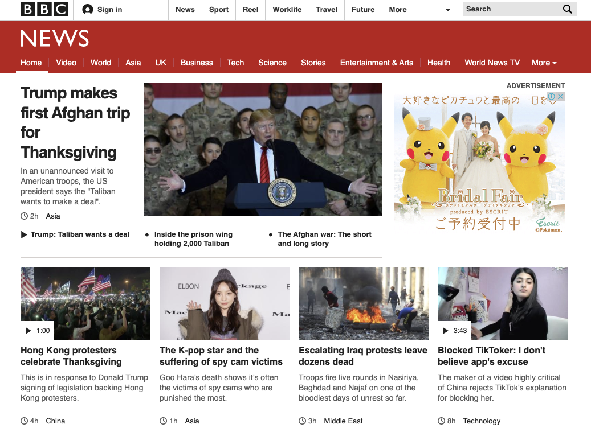

# bbc-news-copy

https://www.udemy.com/course/completeweb2_jp/
これの 「CSSセクションの課題」 の所を作る。

[BBC](https://www.bbc.com/news) のTopページを自分でコードを作ってみる、という課題。

- 元のサイトはレスポンシブ対応とかされているがそういう事はせずに あくまでHTML＋CSSで配置とか色味だけを調整する。
- 完成形は以下のような感じを目指す。
 
